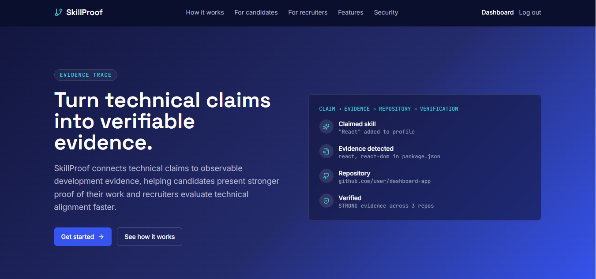
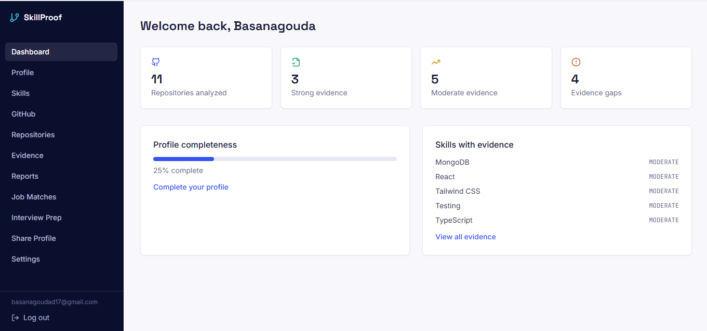
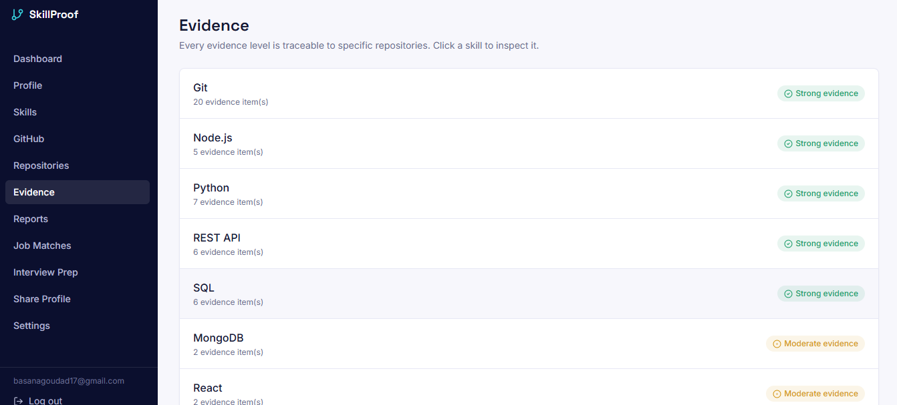
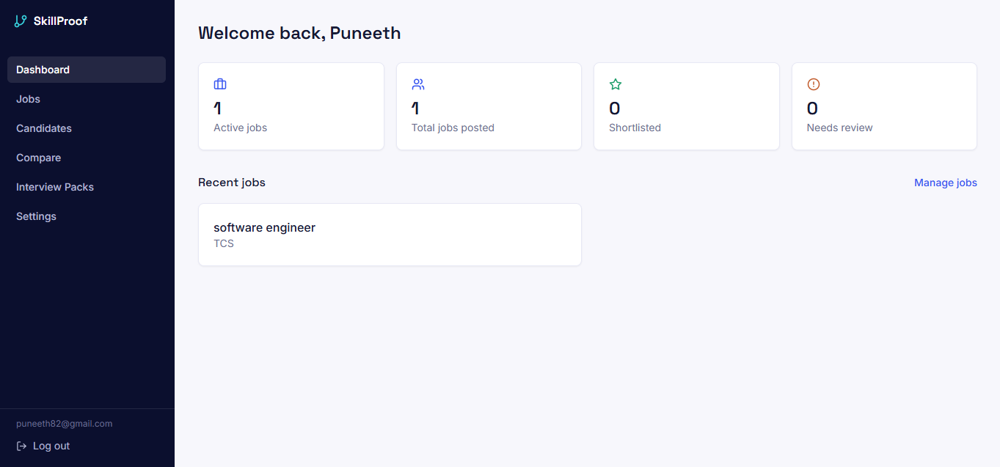

Yes. You want **one single copyable block**, not multiple separate blocks. Here is the complete README in one block:

````markdown
# SkillProof

### Turn technical claims into verifiable evidence.

SkillProof is a full-stack web application that helps verify technical skill claims using observable GitHub repository evidence.

Instead of relying only on self-reported skills in resumes, SkillProof analyzes repository signals such as programming languages, dependencies, topics, README content, and activity to generate traceable technical evidence.

---

## 🔗 Live Demo / GitHub

**Live Application:**  
https://skillproof-ivory.vercel.app/

**GitHub Repository:**  
https://github.com/Basanagouda-2006/skillproof

**Backend:**  
https://skillproof-27vc.onrender.com

**API Health Check:**  
https://skillproof-27vc.onrender.com/api/health

---

## 🎯 Problem

Technical resumes often depend heavily on self-reported skills.

A candidate may claim skills such as:

- React
- Node.js
- MongoDB
- Python

However, a resume alone does not provide much evidence supporting those claims.

SkillProof addresses this by analyzing observable GitHub repository signals and connecting them with technical skill claims.

The goal is not to replace technical interviews, but to provide a transparent evidence layer that can support technical evaluation.

---

## 🚀 Features

### Candidate Features

- User registration and login
- JWT-based authentication
- Candidate profile management
- GitHub username integration
- GitHub repository analysis
- Programming language detection
- Dependency and technology detection
- Repository topic analysis
- README technology analysis
- Deterministic skill evidence
- Evidence reports
- Skill-gap identification
- Evidence-based interview preparation
- Shareable candidate profiles

### Recruiter Features

- Recruiter authentication
- Role-based access control
- Job creation and management
- Job requirement detection
- Candidate discovery
- Candidate/job matching
- Candidate comparison
- Evidence-based candidate evaluation
- Private recruiter notes
- Interview evidence packs

### AI Features

Gemini is used as an optional assistance layer for:

- Explaining verified evidence
- Summarizing skill gaps
- Generating evidence-grounded interview questions

AI does not create or invent repository evidence.

If Gemini is unavailable, the core deterministic evidence system continues to work.

---

## 🔄 How It Works

```text
GitHub Username
      ↓
Repository Data
      ↓
Repository Analysis
      ↓
Signal Extraction
      ↓
Deterministic Evidence Engine
      ↓
Skill Evidence
      ↓
Optional AI Explanation
      ↓
Reports / Matching / Interview Preparation
````

The evidence engine uses deterministic, rule-based logic to evaluate repository signals.

### Evidence Levels

| Level           | Meaning                              |
| --------------- | ------------------------------------ |
| **STRONG**      | Strong supporting repository signals |
| **MODERATE**    | Meaningful but incomplete evidence   |
| **WEAK**        | Limited supporting evidence          |
| **NO EVIDENCE** | No supported evidence detected       |

Evidence is traceable to the repository and supporting signals used by the evidence engine.

---

## 🛠️ Tech Stack

### Frontend

* React
* TypeScript
* Vite
* Tailwind CSS
* React Router
* Axios
* Recharts
* Lucide React

### Backend

* Node.js
* Express.js
* MongoDB
* Mongoose
* JWT
* bcryptjs
* express-validator

### APIs

* GitHub REST API
* Gemini API

### Deployment

* Vercel
* Render
* MongoDB Atlas

---

## 🏗️ Architecture

```text
┌──────────────────────────────┐
│      React + Vite            │
│      TypeScript Frontend     │
│                              │
│ Pages / Components / Context │
│ Services / Routing / UI      │
└──────────────┬───────────────┘
               │
               │ REST API
               ↓
┌──────────────────────────────┐
│      Node.js + Express       │
│                              │
│ Authentication              │
│ Authorization               │
│ Validation                  │
│ GitHub Integration           │
│ Evidence Engine              │
│ Matching                     │
│ Reports                      │
│ AI Integration               │
└──────────┬──────────┬────────┘
           │          │
           ↓          ↓
     ┌──────────┐  ┌──────────────┐
     │ MongoDB  │  │ GitHub REST  │
     │  Atlas   │  │     API      │
     └──────────┘  └──────┬───────┘
                           │
                           ↓
                    ┌──────────────┐
                    │ Gemini API   │
                    │  Optional    │
                    └──────────────┘
```

---

## 🖼️ Screenshots

### Landing Page



### Dashboard



### GitHub Analysis


### Evidence Report



### Recruiter Dashboard



---

## 📁 Project Structure

```text
skillproof/
│
├── backend/
│   ├── src/
│   │   ├── config/
│   │   ├── controllers/
│   │   ├── middleware/
│   │   ├── models/
│   │   ├── routes/
│   │   ├── services/
│   │   ├── validators/
│   │   └── utils/
│   │
│   ├── .env.example
│   └── package.json
│
├── frontend/
│   ├── src/
│   │   ├── components/
│   │   ├── context/
│   │   ├── layouts/
│   │   ├── pages/
│   │   ├── services/
│   │   └── types/
│   │
│   ├── .env.example
│   └── package.json
│
├── docs/
│   ├── evidence-engine.md
│   └── screenshots/
│
├── .gitignore
└── README.md
```

---

## 🔐 Security

SkillProof uses backend-focused security controls including:

* JWT authentication
* bcrypt password hashing
* Role-based authorization
* Protected API routes
* Resource ownership checks
* Request validation
* Authentication rate limiting
* CORS protection
* Helmet security headers
* Environment-based secret management

Sensitive credentials are stored in backend environment variables and are not exposed to the frontend.

Examples include:

```text
MONGO_URI
JWT_SECRET
GITHUB_TOKEN
GEMINI_API_KEY
```

---

## ⚙️ Local Setup

### 1. Clone the Repository

```bash
git clone https://github.com/Basanagouda-2006/skillproof.git
cd skillproof
```

### 2. Backend

```bash
cd backend
npm install
```

Create a `.env` file:

```env
PORT=5000
NODE_ENV=development

MONGO_URI=your_mongodb_connection
JWT_SECRET=your_jwt_secret
JWT_EXPIRES_IN=7d

GITHUB_TOKEN=
GEMINI_API_KEY=

CLIENT_URL=http://localhost:5173
```

Start the backend:

```bash
npm run dev
```

Backend:

```text
http://localhost:5000
```

### 3. Frontend

Open another terminal:

```bash
cd frontend
npm install
```

Create `.env`:

```env
VITE_API_URL=http://localhost:5000/api
```

Start the frontend:

```bash
npm run dev
```

Frontend:

```text
http://localhost:5173
```

> Never commit real `.env` files or secret credentials to GitHub.

---

## 🌐 Environment Variables

### Backend

```env
PORT=5000
NODE_ENV=development
MONGO_URI=your_mongodb_connection
JWT_SECRET=your_jwt_secret
JWT_EXPIRES_IN=7d
GITHUB_TOKEN=
GEMINI_API_KEY=
CLIENT_URL=http://localhost:5173
```

### Frontend

```env
VITE_API_URL=http://localhost:5000/api
```

### Production

**Frontend:**

```env
VITE_API_URL=https://skillproof-27vc.onrender.com/api
```

**Backend:**

```env
NODE_ENV=production
CLIENT_URL=https://skillproof-ivory.vercel.app
```

Real secrets must only be configured through the deployment platform's environment variable settings.

---

## 🚀 Deployment

### Frontend — Vercel

**Build Command:**

```text
npm run build
```

**Output Directory:**

```text
dist
```

**Production API URL:**

```env
VITE_API_URL=https://skillproof-27vc.onrender.com/api
```

### Backend — Render

**Build Command:**

```text
npm install
```

**Start Command:**

```text
npm start
```

Configure the backend environment variables in Render.

### Database

MongoDB Atlas is used as the production database.

---

## ⚠️ Limitations

* GitHub evidence does not prove professional mastery or code quality.
* The current implementation primarily focuses on observable public GitHub repository data.
* The skill vocabulary is based on curated technical rules.
* AI explanations depend on Gemini availability.
* AI is optional and is not required for deterministic evidence generation.

---

## 🔮 Future Improvements

* GitHub OAuth with scoped permissions
* Private repository support
* Commit-level contribution analysis
* Pull request analysis
* Expanded technical skill rules
* Automated unit and integration testing
* Advanced candidate filtering
* More detailed repository activity analysis

---

## 👨‍💻 Author

**Basanagouda D**

BCA Student | Full-Stack Developer

**GitHub:**
[https://github.com/Basanagouda-2006](https://github.com/Basanagouda-2006)

**Live Project:**
[https://skillproof-ivory.vercel.app/](https://skillproof-ivory.vercel.app/)

